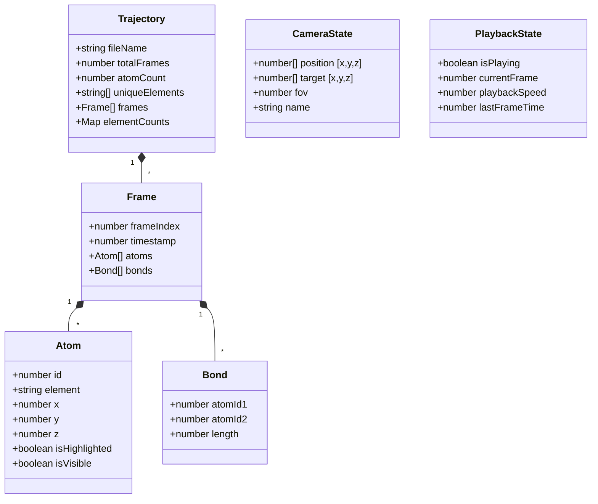

## 1. 架构设计

```mermaid
graph TD
    "用户界面层 UI" --> "状态管理层 Zustand"
    "状态管理层 Zustand" --> "事件总线 EventBus"
    "事件总线 EventBus" --> "轨迹解析器 XYZParser"
    "事件总线 EventBus" --> "3D 渲染内核 RenderKernel"
    "事件总线 EventBus" --> "播放控制器 PlaybackController"
    "事件总线 EventBus" --> "视角控制器 CameraController"
    "事件总线 EventBus" --> "筛选高亮器 FilterHighlighter"
    "事件总线 EventBus" --> "参数导出器 Exporter"
    
    "3D 渲染内核 RenderKernel" --> "材质配置 MaterialConfig"
    "3D 渲染内核 RenderKernel" --> "类型定义 TypeDefinitions"
    "轨迹解析器 XYZParser" --> "类型定义 TypeDefinitions"
    
    subgraph "React 组件层"
        "LeftPanel 左侧控制栏"
        "CenterCanvas 中央3D画布"
        "RightPanel 右侧筛选栏"
        "TopBar 顶部操作条"
    end
    
    subgraph "核心引擎层"
        "轨迹解析器 XYZParser"
        "3D 渲染内核 RenderKernel"
        "播放控制器 PlaybackController"
        "视角控制器 CameraController"
        "筛选高亮器 FilterHighlighter"
        "参数导出器 Exporter"
    end
    
    subgraph "基础设施层"
        "事件总线 EventBus"
        "材质配置 MaterialConfig"
        "类型定义 TypeDefinitions"
        "状态管理 Zustand Store"
    end
```

## 2. 技术栈说明

- **前端框架**：React@18 + TypeScript@5 + Vite@5
- **3D 渲染引擎**：three@0.160（原生 Three.js，避免 R3F 额外开销以保证性能）
- **状态管理**：zustand@4（轻量级，原子化状态更新避免不必要重渲染）
- **UI 样式**：tailwindcss@3 + PostCSS
- **图标库**：lucide-react
- **无后端**：纯前端，文件读取使用 FileReader API

## 3. 路由定义

| 路由 | 用途 |
|-----|------|
| / | 主工作台（唯一页面，单页应用） |

## 4. 目录结构

```
src/
├── types/                      # 类型定义文件
│   └── index.ts                # 原子/轨迹/化学键/视角等核心类型
├── core/                       # 核心引擎模块
│   ├── XYZParser.ts            # XYZ 轨迹文件解析器
│   ├── RenderKernel.ts         # 3D 渲染内核（原子+化学键）
│   ├── PlaybackController.ts   # 播放进度控制器
│   ├── CameraController.ts     # 视角锁定与相机控制器
│   ├── FilterHighlighter.ts    # 原子筛选高亮器
│   └── Exporter.ts             # 轨迹参数导出器
├── utils/                      # 基础设施工具
│   ├── EventBus.ts             # 发布订阅事件总线
│   └── MaterialConfig.ts       # 元素材质与颜色配置
├── store/                      # Zustand 状态管理
│   └── useAppStore.ts
├── components/                 # React UI 组件
│   ├── layout/
│   │   ├── LeftPanel.tsx       # 左侧：上传+帧控制
│   │   ├── CenterCanvas.tsx    # 中央：3D 画布
│   │   ├── RightPanel.tsx      # 右侧：元素筛选
│   │   └── TopBar.tsx          # 顶部：视角+导出
│   ├── panels/
│   │   ├── FileUploader.tsx
│   │   ├── PlaybackControls.tsx
│   │   ├── ElementFilter.tsx
│   │   ├── CameraPresets.tsx
│   │   └── ExportMenu.tsx
│   └── common/
│       ├── HUD.tsx
│       └── IconButton.tsx
├── pages/
│   └── Workbench.tsx           # 主工作台页面
├── hooks/
│   ├── useAnimationFrame.ts
│   └── useFileDrop.ts
├── App.tsx
├── main.tsx
└── index.css
```

## 5. 核心数据模型

### 5.1 数据结构定义



## 6. 事件总线事件定义

| 事件名 | 触发时机 | 负载数据 |
|-------|---------|---------|
| TRAJECTORY_LOADED | XYZ 文件解析完成 | Trajectory |
| FRAME_CHANGED | 当前帧切换 | frameIndex |
| PLAYBACK_STATE_CHANGED | 播放/暂停/倍速变化 | PlaybackState |
| ELEMENT_FILTER_CHANGED | 元素筛选条件变更 | {visibleElements, highlightedElements, customColors} |
| CAMERA_STATE_CHANGED | 相机视角变化 | CameraState |
| CAMERA_PRESET_SAVED | 视角预设保存 | CameraState |
| EXPORT_REQUESTED | 导出操作触发 | {type, options} |
| RENDER_PERFORMANCE | 每帧渲染性能上报 | {fps, frameTime, drawCalls} |

## 7. 性能优化策略

1. **InstancedMesh 批量渲染**：相同元素的原子共享几何体与材质，通过矩阵数组批量绘制，Draw Call 数 = 元素种类数（而非原子数）
2. **帧间插值平滑**：在 2 个关键帧之间基于时间线性插值原子位置，降低对原始轨迹帧率的依赖
3. **化学键空间哈希**：构建原子空间网格哈希，O(n) 复杂度判定相邻原子，避免 O(n²) 全量比较
4. **对象池复用**：Three.js 场景中的 Mesh、Geometry、Material 对象预先创建，帧更新仅修改 matrix 数组
5. **防抖状态更新**：高频 UI 操作（滑块拖拽）通过 16ms 节流合并到 requestAnimationFrame
6. **WebWorker 解析**：XYZ 文件解析在 WebWorker 中执行，解析过程不阻塞主线程渲染
7. **几何 LOD**：远距离使用低面数球体（16 段），近距离使用高面数（32 段）
8. **可见性剔除**：Frustum Culling 启用，不可见原子不参与绘制
